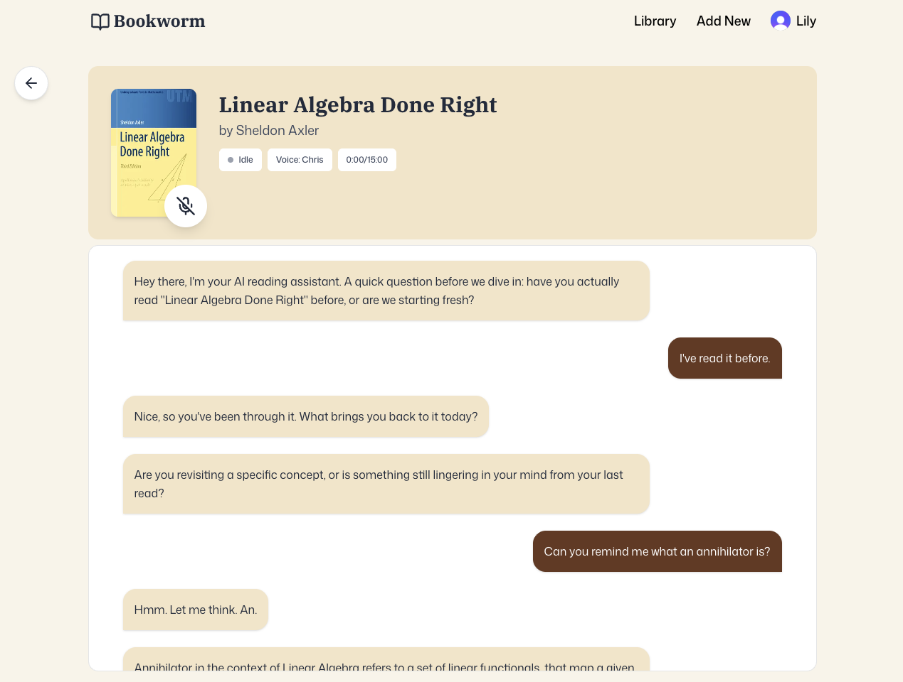

# Bookworm
Bookworm is a library management web application that features an AI reading assistant, allowing you to have conversations with your books.


The AI assistant parses your voice and natural language and allows you to ask it about any topic covered in the book in a real-time conversation.


## Running Locally

First, you must define environment variables in a `.env.local` file in the root of the project. The application utilises the following services: Clerk authorisation, MongoDB Atlas, Vercel Blob Storage, and Vapi.

```bash
# Clerk
NEXT_PUBLIC_CLERK_PUBLISHABLE_KEY=xxxxxxxxxxxxxxxxxxxx
CLERK_SECRET_KEY=xxxxxxxxxxxxxxxxxxxx

# MongoDB
MONGODB_URI=xxxxxxxxxxxxxxxxxxxx

# Vercel blob
VERCEL_BLOB_STORE_ID=xxxxxxxxxxxxxxxxxxxx
BLOB_READ_WRITE_TOKEN=xxxxxxxxxxxxxxxxxxxx
BLOB_HOSTNAME=xxxxxxxxxxxxxxxxxxxx

# Vapi
NEXT_PUBLIC_VAPI_API_KEY=xxxxxxxxxxxxxxxxxxxx
NEXT_PUBLIC_ASSISTANT_ID=xxxxxxxxxxxxxxxxxxxx

# the credential Vapi uses to communicate with our server
VAPI_CREDENTIAL=xxxxxxxxxxxxxxxxxxxx
```

Install the project's dependancies by running the following in the project's root:

```bash
npm install
```

Then, run the development server:

```bash
npm run dev
```

Open [http://localhost:3000](http://localhost:3000) with your browser to see the result.
